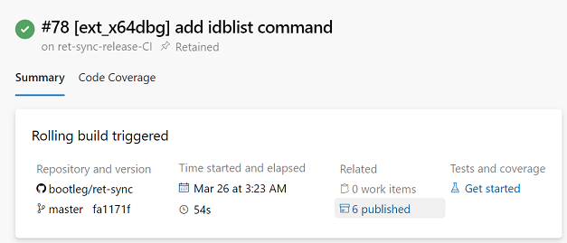
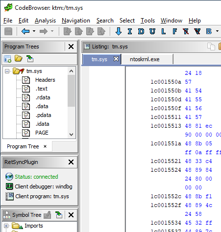

# ret-sync

**ret-sync** stands for Reverse-Engineering Tools SYNChronization. It is a set
of plugins that help to synchronize a debugging session
(WinDbg/GDB/LLDB/OllyDbg/OllyDbg2/x64dbg) with a disassembler (IDA/Ghidra/Binary Ninja).
The underlying idea is simple: take the best from both worlds (static and
dynamic analysis).

Debuggers and dynamic analysis provide us with:

* local view, with live dynamic context (registers, memory, *etc.*)
* built-in specialized features/API (ex: WinDbg's ``!peb``, ``!drvobj``,
``!address``, *etc.*)

Disassemblers and static analysis provide us with:

* macro view over modules
* code analysis, signatures, types, *etc.*
* fancy graph view
* decompilation
* persistent storage of knowledge within IDBs/GPRs

Key features:

* synchronize graph and decompilation views with debugger's state
* no need to deal with ASLR, addresses are rebased on-the-fly
* pass data (comment, command output) from debugger to disassembler
* multiple IDBs/GPRs can be synced at the same time allowing to easily trace
  through multiple modules
* disassembler and debugger can be on different hosts / VMs

**ret-sync** is a fork of [qb-sync](https://github.com/quarkslab/qb-sync)
that I developed and maintained during my stay at
[Quarkslab](http://www.quarkslab.com).


-------------------------------------------------------------------------------
# Table of contents

- [Repository content](#repository-content)
- [General prerequisites](#general-prerequisites)
- [Binary release](#binary-release)
- [**ret-sync** configuration](#ret-sync-configuration)
- [Installation](#installation)
  - [IDA extension](#ida-extension)
  - [Ghidra extension](#ghidra-extension)
  - [Binary Ninja extension](#binary-ninja-extension)
  - [WinDbg extension](#windbg-extension)
  - [GNU gdb (GDB) installation](#gnu-gdb-gdb-installation)
  - [LLDB installation](#lldb-installation)
  - [OllyDbg 1.10 installation](#ollydbg-110-installation)
  - [OllyDbg2 installation](#ollydbg2-installation)
  - [x64dbg installation](#x64dbg-installation)
- [Usage](#usage)
  - [**ret-sync** debugger commands](#ret-sync-debugger-commands)
  - [IDA usage](#ida-usage)
  - [Ghidra usage](#ghidra-usage)
  - [Binary Ninja usage](#binary-ninja-usage)
  - [WinDbg usage](#windbg-usage)
  - [GNU gdb (GDB) usage](#gnu-gdb-gdb-usage)
  - [LLDB usage](#lldb-usage)
  - [OllyDbg 1.10 usage](#ollydbg-110-usage)
  - [OllyDbg2 usage](#ollydbg2-usage)
  - [x64dbg usage](#x64dbg-usage)
  - [Python library usage](#python-library-usage)
- [Extend](#extend)
- [TODO](#todo)
- [Known Bugs/Limitations](#known-bugslimitations)
- [License](#license)
- [Greetz](#greetz)
-------------------------------------------------------------------------------

# Repository content

The debugger plugins:

* `ext_windbg/sync`: WinDbg extension source files, once built: `sync.dll`
* `ext_gdb/sync.py`: GDB plugin
* `ext_lldb/sync.py`: LLDB plugin
* `ext_olly1`: OllyDbg 1.10 plugin
* `ext_olly2`: OllyDbg v2 plugin
* `ext_x64dbg`: x64dbg plugin

The disassembler plugins:

* `ext_ida/SyncPlugin.py`
* `ext_ghidra/dist/ghidra_*_retsync.zip`: Ghidra plugin
* `ext_bn/retsync`: Binary Ninja plugin


And the library plugin:

* `ext_lib/sync.py`: standalone Python library


# General prerequisites

IDA and GDB plugins require a valid Python setup. Python 2 (>=2.7) and Python
3 are supported.


# Binary release

Pre-built binaries for WinDbg/OllyDbg/OllyDbg2/x64dbg debuggers are proposed
through an ``Azure DevOps`` pipeline: [](https://dev.azure.com/bootlegdev/ret-sync-release/_build/latest/ret-sync-release-CI?definitionId=8?branchName=master)

Select the last build and check the artifacts under the ``Related`` section: ``6 published``.




A pre-built plugin archive of the Ghidra plugin is provided in `ext_ghidra/dist`.


# **ret-sync** configuration

**ret-sync** should work out of the box for most users with a typical setup:
debugger and disassembler(s) on the same host, module names matching.

Still, in some scenarios a specific configuration may be used. For that,
extensions and plugins check for an optional global configuration file named
`.sync` in the user's home directory. It must be a valid ``.INI`` file.

Additionally, the IDA and Ghidra plugins also look for the configuration file
in the IDB or project directory (`<project>.rep`) first to allow local,
per-IDB/project, settings. If a local configuration file is present, the
global configuration file is ignored.

Values declared in these configuration files override default values. Please
note, that **no** `.sync` file is created by default.

Below we detail, three common scenarios where a configuration file is
useful/needed:

* Remote debugging
* Modules names mismatch
* Missing PID


## Remote debugging: debugger and disassembler are on different hosts

The ``[INTERFACE]`` section is used to customize network related settings.
Let's suppose one wants to synchronize IDA with a debugger running inside a
virtual machine (or simply another host), common remote kernel debugging
scenario.

Simply create two ``.sync`` file:

* one on the machine where IDA is installed, in the IDB directory:
* For Ghidra, place at home directory, ex. "/home/user" or "C:\Users\user".
```
[INTERFACE]
host=192.168.128.1
port=9234
```

It tells **ret-sync** ``IDA`` plugin to listen on the interface
``192.168.128.1`` with port ``9234``. It goes without saying that this
interface must be reachable from the remote host or virtual machine.

* one on the machine where the debugger is executed, in the user's home directory:

```
[INTERFACE]
host=192.168.128.1
port=9234
```

It tells **ret-sync** debugger plugin to connect to the **ret-sync** ``IDA``
plugin configured previously to listen in this interface.


***NOTE:*** You must specify a real IP here, and not use `0.0.0.0`. This is
because the variable is used by multiple sources both for binding and
connecting, so using `0.0.0.0` will result in weird errors.


## IDB and debugger modules names are different

```
[ALIASES]
ntoskrnl_vuln.exe=ntkrnlmp.exe
```

The ``[ALIASES]`` section is used to customize the name which is used by a
disassembler (IDA/Ghidra) to register a module to its dispatcher/program
manager.

By default, disassembler plugins use the name of the input file. However one
may have renamed the file beforehand and it doesn't match anymore the name of
the actual process or loaded module as seen by the debugger.

Here we simply tell to the dispatcher to match the name `ntkrnlmp.exe` (real
name) instead of `ntoskrnl_vuln.exe` (IDB name).


## gdb with Qt Creator debugging frontend

The Qt Creator debugging frontend changes the way gdb command output is logged. Since
this would interfere with the synchronization an option exists to use the raw gdb output
for synchronization instead of a temporary file. In the .sync configuration file use

```
[GENERAL]
use_tmp_logging_file=false
```

if you wish to use the Qt debugging frontend for the target.

## Embedded devices and missing ``/proc/<pid>/maps``

In some scenarios, such as debugging embedded devices over serial or raw
firmware in QEMU, gdb is not aware of the PID and cannot access
``/proc/<pid>/maps``.

In these cases, The ``[INIT]`` section is used to pass a custom context to the
plugin. It allows overriding some fields such as the PID and memory mappings.

`.sync` content extract:

```
[INIT]
context = { "pid": 200, "mappings": [ [0x400000, 0x7A81158, 0x7681158, "asav941-200.qcow2|lina"] ] }
```

Each entry in the mappings is: ``mem_base``, ``mem_end``, ``mem_size``, ``mem_name``.

If doing this with ghidra:
- Make sure the context entry is a single line, or you will get parsing errors in the ghidra output window!
- Make sure the mem_name matches the name of the module (name next to folder icon in program tree window) exactly!

## Bypassing automatic address rebasing

In some scenarios, such as debugging embedded devices or connecting to
minimalist debug interfaces, it may be more convenient to bypass the
automatic address rebasing feature implemented in the disassembler plugins.

The `use_raw_addr` option is currently supported only for Ghidra. In
the .sync configuration file use:

```
[GENERAL]
use_raw_addr=true
```


# Installation

## IDA extension

### IDA prerequisites

IDA 7.x branch is required. For older versions (6.9x) please see archived
release ``ida6.9x``.

### Install the IDA extension

For IDA installation, copy ``Syncplugin.py`` and ``retsync`` folder from
``ext_ida`` to IDA plugins directory, for example:

* ``C:\Program Files\IDA Pro 7.4\plugins``
* ``%APPDATA%\Hex-Rays\IDA Pro\plugins``
* ``~/.idapro/plugins``

### Run the IDA extension

1. Open IDB
2. Run the plugin in IDA (``Alt-Shift-S``) or ``Edit`` -> ``Plugins`` -> ``ret-sync``

```
[sync] default idb name: ld.exe
[sync] sync enabled
[sync] cmdline: "C:\Program Files\Python38\python.exe" -u "C:\Users\user\AppData\Roaming\Hex-Rays\IDA Pro\plugins\retsync\broker.py" --idb "target.exe"
[sync] module base 0x100400000
[sync] hexrays #7.3.0.190614 found
[sync] broker started
[sync] plugin loaded
[sync] << broker << dispatcher not found, trying to run it
[sync] << broker << dispatcher now runs with pid: 6544
[sync] << broker << connected to dispatcher
[sync] << broker << listening on port 63107

```

### IDA plugin troubleshooting

To troubleshoot issues with the IDA extension two options are available in the
file `retsync/rsconfig.py`:

```
LOG_LEVEL = logging.INFO
LOG_TO_FILE_ENABLE = False
```

Setting `LOG_LEVEL` value to ` logging.DEBUG` makes the plugin more verbose.

Setting `LOG_TO_FILE_ENABLE` value to `True` triggers the logging of exception
information from `broker.py` and `dispatcher.py` into dedicated files. Log file
are generated in the `%TMP%` folder with a name pattern `retsync.%s.err` .


## Ghidra extension

### Build the Ghidra extension

Either use the pre-built version from the `ext_ghidra/dist` folder or follow the instruction to build it.
Each extension build only supports the version of Ghidra specified in the plugin's file name.
E.g. `ghidra_9.1_PUBLIC_20191104_retsync.zip` is for Ghidra 9.1 Public.

1. Install Ghidra
2. Install gradle

```bash
apt install gradle
```

3. Build extension for your Ghidra installation (replace `$GHIDRA_DIR` with your installation directory)

```bash
cd ext_ghidra
gradle -PGHIDRA_INSTALL_DIR=$GHIDRA_DIR
```

### Install the Ghidra extension

1. From Ghidra projects manager: ``File`` -> ``Install Extensions...``, click on the
   `+` sign and select the `ext_ghidra/dist/ghidra_*_retsync.zip` and click OK.
   This will effectively extract the `retsync` folder from the zip into
   `$GHIDRA_DIR/Extensions/Ghidra/`
2. Restart Ghidra as requested
3. After reloading Ghidra, open a module in CodeBrowser. It should tell you a
   new extension plugin has been detected. Select "yes" to configure it. Then
   tick "RetSyncPlugin" and click OK. The console should show something like:

```
[*] retsync init
[>] programOpened: tm.sys
    imageBase: 0x1c0000000
```

4. From Ghidra CodeBrowser tool: use toolbar icons or shortcuts to enable (``Alt+s``)/disable (``Alt+Shift+s``)/restart (``Alt+r``)
   synchronization.

A status window is also available from ``Windows`` -> ``RetSyncPlugin``. You
generally want to drop it on the side to integrate it with the Ghidra
environment windows.


## Binary Ninja extension

Binary Ninja support is experimental, make sure to backup your analysis
databases.

### Binary Ninja prerequisites

**ret-sync** requires Binary Ninja version 2.2 at minimum as well as Python 3
(Python 2 is not supported).


### Install the Binary Ninja extension

**ret-sync** is not yet distributed through the Binary Ninja's Plugin Manager;
a manual installation is required. Simply copy that content of the `ext_bn`
folder into Binary Ninja's plugins folder, for example:

`%APPDATA%\Binary Ninja\plugins`

After restarting Binary Ninja, the following output should be present in the
console window:

```
[sync] commands added
Loaded python3 plugin 'retsync'
```


## WinDbg extension

### Build the WinDbg extension

Either use pre-built binaries or use the Visual Studio 2017
solution provided in ``ext_windbg``, (see
https://docs.microsoft.com/en-us/visualstudio/releasenotes/vs2017-relnotes if
needed).

This will build the `x64\release\sync.dll` file.

### Install the WinDbg extension

You will need to copy the resulting `sync.dll` file into the
appropriate Windbg extension path.

* WinDbg Classic:

For earlier versions of Windbg this is is something like this (be
careful of ``x86``/``x64`` flavours), for example

`C:\Program Files (x86)\Windows Kits\10\Debuggers\x64\winext\sync.dll`

* Windbg Preview

The folder for storing extension seems to be based on the PATH, so you need to
put it one of the queried locations.

One example is to put it here:

`C:\Users\user\AppData\Local\Microsoft\WindowsApps\sync.dll`

### Run the WinDbg extension

1. Launch WinDbg on target
2. Load extension (``.load`` command)

```
    0:000> .load sync
    [sync.dll] DebugExtensionInitialize, ExtensionApis loaded
```

3. Sync WinDbg

```
      0:000> !sync
      [sync] No argument found, using default host (127.0.0.1:9100)
      [sync] sync success, sock 0x5a8
      [sync] probing sync
      [sync] sync is now enabled with host 127.0.0.1
```

E.g. in IDA's Output window

```
      [*] << broker << dispatcher msg: add new client (listening on port 63898), nb client(s): 1
      [*] << broker << dispatcher msg: new debugger client: dbg connect - HostMachine\HostUser
      [sync] set debugger dialect to windbg, enabling hotkeys
```

If Windbg's current module matches IDA file name

```
      [sync] idb is enabled with the idb client matching the module name.
```

### WinDbg installation troubleshooting

Note: If you get the following error, it is because you haven't copied the file
to the right folder in the above steps.

```
0: kd> .load sync
The call to LoadLibrary(sync) failed, Win32 error 0n2
    "The system cannot find the file specified."
Please check your debugger configuration and/or network access.
```

The error below usually means that Windbg tried to load the incorrect flavour
of the extension, ex: ``x64`` in place of the ``x86`` `sync.dll`.

```
0:000> .load sync
The call to LoadLibrary(sync) failed, Win32 error 0n193
    "%1 is not a valid Win32 application."
Please check your debugger configuration and/or network access.
```

As WinDbg Preview loads both plugins (``x86`` and  ``x64``) from the same
directory, one can rename the ``x86`` file `sync32.dll`.

```
0:000> .load sync32
```


## GNU gdb (GDB) installation

1. Copy the `ext_gdb/sync.py` to the directory of your choice
2. Load the extension (see auto-load-scripts)

```
    gdb> source sync.py
    [sync] configuration file loaded 192.168.52.1:9100
    [sync] commands added
```

## LLDB installation

LLDB support is experimental, however:

1. Load extension (can also be added in ``~/.lldbinit``)

```
    lldb> command script import sync
```

## OllyDbg 1.10 installation

OllyDbg 1.10 support is experimental, however:

1. Build the plugin using the VS solution (optional, see pre-built binaries)
2. Copy the dll within OllyDbg's plugin directory

## OllyDbg2 installation

OllyDbg2 support is experimental, however:

1. Build the plugin using the VS solution (optional, see pre-built binaries)
2. Copy the dll within OllyDbg2's plugin directory

## x64dbg installation

Based on testplugin,  https://github.com/x64dbg/testplugin. x64dbg support is experimental, however:

1. Build the plugin using the VS solution (optional, see pre-built binaries).
   May you need a different version of the plugin sdk,
   a copy can be found in each release of x64dbg.
   Paste the "``pluginsdk``" directory into "``ext_x64dbg\x64dbg_sync``"
2. Copy the dll (extension is ``.d32`` or ``.dp64``) within x64dbg's plugin directory.

# Usage

## **ret-sync** debugger commands

For command-line oriented debuggers (mainly Windbg and GDB) a set of commands
is exposed by **ret-sync** to assist in the reverse-engineering task.

The commands below are generic (Windbg and GDB), please note that a `!`
prefix is needed on WinDbg (e.g.: `sync`  in GDB, `!sync` in Windbg).

| Debugger command           | Description                                                                               |
|----------------------------|-------------------------------------------------------------------------------------------|
| `synchelp`                   | Display the list of available commands with short explanation                             |
| `sync`                       | Start synchronization                                                                     |
| `syncoff`                    | Stop synchronization                                                                      |
| `cmt [-a address] <string>`  | Add a comment at current ip in disassembler                                               |
| `rcmt [-a address]`          | Reset comment at current ip in disassembler                                               |
| `fcmt [-a address] <string>` | Add a function comment for function in which current ip is located                        |
| `raddr <expression>`         | Add a comment with rebased address evaluated from expression                              |
| `rln <expression>`           | Get symbol from the disassembler for the given address                                    |
| `lbl [-a address] <string>`  | Add a label name at current ip in disassembler                                            |
| `cmd <string>`               | Execute a command in debugger and add its output as comment at current ip in disassembler |
| `bc <\|\|on\|off\|set 0xBBGGRR>` | Enable/disable path coloring in disassembler                                              |
| `idblist`                    | Get list of all IDB clients connected to the dispatcher                                   |
| `syncmodauto <on\|off>`       | Enable/disable disassembler auto switch based on module name                              |
| `idbn <n>`                   | Set active IDB to the nth client                                                          |
| `jmpto <expression>`         |                                                                                           |
| `jmpraw <expression>` | If an IDB is enabled then disassembler's view is synced with the resulting address.    |
| `translate <base> <addr> <mod>` | rebase an address with respect to its module's name and offset   |


WinDbg specific commands:

| Debugger command           | Description                                                                               |
|----------------------------|-------------------------------------------------------------------------------------------|
| `curmod`  |  Display module infomation for current instruction offset (for troubleshooting) |
| `modlist`  |  Debugger Markup Language (DML) enhanced module list meant for smoother active idb switching  |
| `idb <module name>`  |  Set given module as the active idb (see `modlist` enhanced version of `lm`) |
| `modmap <base> <size> <name>` |  A synthetic ("faked") module (defined using its base address and size) is added to the debugger internal list  |
| `modunmap <base>` |  Remove a previously mapped synthetic module at base address  |
| `modcheck <\|\|md5>`  |  Use to check if current module really matches IDB's file (ex: module has been updated)  |
| `bpcmds <\|\|save\|load\|>` | **bpcmds** wrapper, save and reload **.bpcmds** (breakpoints commands list) output to current IDB  |
| `ks` | Debugger Markup Language (DML) enhanced output of **kv** command   |


GDB specific commands:

| Debugger command           | Description                                                                               |
|----------------------------|-------------------------------------------------------------------------------------------|
|`bbt` |  Beautiful backtrace. Similar to **bt** in GDB but requests symbols from disassembler  |
| `patch`  | Patch bytes in disassembler based on live context   |
| `bx` | Similar to GDB **x** but using a symbol. The symbol will be resolved by disassembler   |
| `cc` | Continue to cursor in disassembler  |


## IDA usage

### IDA plugin's GUI

The ``Overwrite idb name`` input field is meant to change the default IDB
name. It is the name that is used by the plugin to register with the
dispatcher. IDB automatic switch is based on module name matching. In case of
conflicting names (like a ``foo.exe`` and ``foo.dll``), this can be used to
ease matching. Please note, if you modify the input field while the sync is
active, you have to re-register with the dispatcher; this can be done simply
by using the "``Restart``" button.

As a reminder it is possible to alias by default using the ``.sync`` configuration file.


### IDA global shortcuts

**ret-sync** defines these global shortcuts in IDA:

* ``Alt-Shift-S``  - Run **ret-sync** plugin
* ``Ctrl-Shift-S``  - Toggle global syncing
* ``Ctrl-H``  - Toggle Hex-Rays syncing

Two buttons are also available in the Debug toolbar to toggle global and
Hex-Rays syncing.

### IDA bindings over debugger commands

``Syncplugin.py`` also registers debugger command wrapper hotkeys.

* ``F2`` - Set breakpoint at cursor address
* ``F3`` - Set one-shot breakpoint at cursor address
* ``Ctrl-F2`` - Set hardware breakpoint at cursor address
* ``Ctrl-F3`` - Set one-shot hardware breakpoint at cursor address
* ``Alt-F2`` - Translate (rebase in debugger) current cursor address
* ``Alt-F5`` - Go
* ``Ctrl-Alt-F5`` - Run (GDB only)
* ``F10`` - Single step
* ``F11`` - Single trace

These commands are only available when the current IDB is active. When
possible they have also been implemented for others debuggers.

## Ghidra usage

### Ghidra plugin's GUI

Once the RetSyncPlugin opened, you can add it to the CodeBrowser window by simple
drag'n'drop:



If you want to view several modules, files need to be open in the same CodeBrowser
viewer, simply drag'n'drop the additional ones in the CodeBrowser window to obtain
the result as above.

### Ghidra global shortcuts

**ret-sync** defines these global shortcuts in Ghidra:

* ``Alt-S``  - Enable syncing
* ``Alt-Shift-S``  - Disable syncing
* ``Alt-R``  - Restart syncing
* ``Alt-Shift-R``  - Reload configuration

### Ghidra bindings over debugger commands

Bindings over debugger commands are also implemented. They are similar to the
ones from IDA's extension (except the "Go" command).

* ``F2``  - Set breakpoint at cursor address
* ``Ctrl-F2`` - Set hardware breakpoint at cursor address
* ``Alt-F3`` - Set one-shot breakpoint at cursor address
* ``Ctrl-F3`` - Set one-shot hardware breakpoint at cursor address
* ``Alt-F2`` - Translate (rebase in debugger) current cursor address
* ``F5`` - Go
* ``Alt-F5`` - Run (GDB only)
* ``F10`` - Single step
* ``F11`` - Single trace


## Binary Ninja usage

### Binary Ninja global shortcuts

**ret-sync** defines these global shortcuts in Binary Ninja:

* ``Alt-S``  - Enable syncing
* ``Alt-Shift-S``  - Disable syncing


### Binary Ninja shortcuts

Bindings over debugger commands are also implemented. They are similar to the
ones from IDA's extension.

* ``F2``  - Set breakpoint at cursor address
* ``Ctrl-F2`` - Set hardware breakpoint at cursor address
* ``Alt-F3`` - Set one-shot breakpoint at cursor address
* ``Ctrl-F3`` - Set one-shot hardware breakpoint at cursor address
* ``Alt-F2`` - Translate (rebase in debugger) current cursor address
* ``Alt-F5`` - Go
* ``F10`` - Single step
* ``F11`` - Single trace


## WinDbg usage

### WinDbg plugin commands

* **!sync**: Start synchronization
* **!syncoff**: Stop synchronization
* **!synchelp**: Display the list of available commands with short explanation.
* **!cmt [-a address] <string>**: Add comment at current ip in IDA

```
    [WinDbg]
    0:000:x86> pr
    eax=00000032 ebx=00000032 ecx=00000032 edx=0028eebc esi=00000032 edi=00000064
    eip=00430db1 esp=0028ed94 ebp=00000000 iopl=0         nv up ei pl nz na po nc
    cs=0023  ss=002b  ds=002b  es=002b  fs=0053  gs=002b             efl=00000202
    image00000000_00400000+0x30db1:
    00430db1 57    push    edi

    0:000:x86> dd esp 8
    0028ed94  00000000 00433845 0028eebc 00000032
    0028eda4  0028f88c 00000064 002b049e 00000110

    0:000:x86> !cmt 0028ed94  00000000 00433845 0028eebc 00000032
    [sync.dll]  !cmt called

    [IDA]
    .text:00430DB1    push    edi             ; 0028ed94  00000000 00433845 0028eebc 00000032
```

* **!rcmt [-a address]**: Reset comment at current ip in IDA

```
    [WinDbg]
    0:000:x86> !rcmt
    [sync] !rcmt called

    [IDA]
    .text:00430DB1    push    edi
```

* **!fcmt [-a address] <string>**: Add a function comment for function in which current ip is located

```
    [WinDbg]
    0:000:x86> !fcmt decodes buffer with key
    [sync] !fcmt called

    [IDA]
    .text:004012E0 ; decodes buffer with key
    .text:004012E0                 public decrypt_func
    .text:004012E0 decrypt_func    proc near
    .text:004012E0                 push    ebp
```

Note: calling this command without argument reset the function's comment.

* **!raddr <expression>**: Add a comment with rebased address evaluated from expression
* **!rln <expression>**: Get symbol from the disassembler for the given address
* **!lbl [-a address] <string>**: Add a label name at current ip in disassembler

```
    [WinDbg]
    0:000:x86> !lbl meaningful_label
    [sync] !lbl called

    [IDA]
    .text:000000000040271E meaningful_label:
    .text:000000000040271E    mov     rdx, rsp
```

* **!cmd <string>**: Execute a command in WinDbg and add its output as comment at current ip in disassembler

```
    [WinDbg]
    0:000:x86> pr
    eax=00000032 ebx=00000032 ecx=00000032 edx=0028eebc esi=00000032 edi=00000064
    eip=00430db1 esp=0028ed94 ebp=00000000 iopl=0         nv up ei pl nz na po nc
    cs=0023  ss=002b  ds=002b  es=002b  fs=0053  gs=002b             efl=00000202
    image00000000_00400000+0x30db1:
    00430db1 57     push    edi
    [sync.dll]  !cmd r edi

    [IDA]
    .text:00430DB1    push    edi             ; edi=00000064
```

* **!bc <||on|off|set 0xBBGGRR>** : Enable/disable path coloring in disassembler.
  This is NOT a code tracing tool,
  there are efficient tools for that. Each manually stepped instruction is
  colored in the graph. Color a single instruction at current ip if called
  without argument.
  "set" argument is used to set path color with a new hex rgb code (reset color
  if called with a value > 0xFFFFFF).
* **!idblist**: Get list of all IDB clients connected to the dispatcher:

```
    [WinDbg]
    0:000> !idblist
    > currently connected idb(s):
        [0] target.exe
```

* **!syncmodauto <on|off>**: Enable/disable disassembler auto switch based on module name:

```
    [WinDbg]
    0:000> !syncmodauto off

    [IDA]
    [*] << broker << dispatcher msg: sync mode auto set to off
```

* **!idbn <n>**: Set active IDB to the nth client. n should be a valid decimal value.
  This is a semi-automatic mode (personal tribute to the tremendous jj)

```
    [WinDbg]
    0:000:> !idbn 0
    > current idb set to 0
```

In this example, current active IDB client would have been set to:

```
	[0] target.exe.
```

* **!jmpto <expression>**: Expression given as argument is evaluated in the context of the current debugger's status.
  disassembler's view is then synced with the resulting address if a matching module is registered.
  Can be seen as a manual syncing, relocation is automatically performed, on the fly.
  Especially useful for randomly relocated binary.
* **!jmpraw <expression>**: Expression given as argument is evaluated in the context of the current debugger's status.
  If an IDB is enabled then disassembler's view is synced with the resulting address. Address is not rebased
  and there is no IDB switching.
  Especially useful for dynamically allocated/generated code.
* **!modmap <base> <size> <name>**: A synthetic ("faked") module (defined using its base address and size) is added to the debugger internal list.
  From msdn: "If all the modules are reloaded - for example, by calling Reload with the Module parameter set to an empty string - all synthetic modules will be discarded."
  It can be used to more easily debug dynamically allocated/generated code.
* **!modunmap <base>**: Remove a previously mapped synthetic module at base address.
* **!modcheck <||md5>**: Use to check if current module really matches IDB's file (ex: module has been updated)
  When called without an argument, pdb's GUID from Debug Directory is used. It can alternatively use md5,
  but only with a local debuggee (not in remote kernel debugging).
* **!bpcmds <||save|load|>**: **bpcmds** wrapper, save and reload **.bpcmds** (breakpoints commands list) output to current IDB.
  Display (but not execute) saved data if called with no argument.
  Persistent storage is achieved using IDA's netnode feature.
* **!ks**: Debugger Markup Language (DML) enhanced output of **kv** command. Code Addresses are clickable (**!jmpto**) as well as data addresses (**dc**).
* **!translate <base> <addr> <mod>**: Meant to be used from IDA (``Alt-F2`` shortcut), rebase an address with respect to its module's name and offset.

#### Address optional argument

**!cmt**, **!rcmt** and **!fcmt** commands support an optional address option: ``-a`` or ``--address``.
Address should be passed as an hexadecimal value. Command parsing is based on python's
``argparse`` module. To stop line parsing use ``--``.

```
    [WinDbg]
    0:000:x86> !cmt -a 0x430DB2 comment
```

The address has to be a valid instruction's address.

## GNU gdb (GDB) usage

Sync with host:

```
    gdb> sync
    [sync] sync is now enabled with host 192.168.52.1
    <not running>

    gdb> r
    Starting program: /bin/ls
    [Thread debugging using libthread_db enabled]
    Using host libthread_db library "/lib/libthread_db.so.1".
```

### GDB plugin commands

Use commands, **without "!" prefix**

```
    (gdb) cmd x/i $pc
    [sync] command output: => 0x8049ca3:    push   edi

    (gdb) synchelp
    [sync] extension commands help:
     > sync <host>
     > syncoff
     > cmt [-a address] <string>
     > rcmt [-a address] <string>
     > fcmt [-a address] <string>
     > cmd <string>
     > bc <on|off|>
     > rln <address>
     > bbt <symbol>
     > patch <addr> <count> <size>
     > bx /i <symbol>
     > cc
     > translate <base> <addr> <mod>
```

* **rln**: Get symbol from the IDB for the given address
* **bbt**: Beautiful backtrace. Similar to **bt** but requests symbols from disassembler

```
    (gdb) bt
    #0  0x0000000000a91a73 in ?? ()
    #1  0x0000000000a6d994 in ?? ()
    #2  0x0000000000a89125 in ?? ()
    #3  0x0000000000a8a574 in ?? ()
    #4  0x000000000044f83b in ?? ()
    #5  0x0000000000000000 in ?? ()
    (gdb) bbt
    #0 0x0000000000a91a73 in IKE_GetAssembledPkt ()
    #1 0x0000000000a6d994 in catcher ()
    #2 0x0000000000a89125 in IKEProcessMsg ()
    #3 0x0000000000a8a574 in IkeDaemon ()
    #4 0x000000000044f83b in sub_44F7D0 ()
    #5 0x0000000000000000 in  ()
```


* **patch**: Patch bytes in disassembler based on live context
* **bx**: Beautiful display. Similar to **x** but using a symbol. The symbol
  will be resolved by disassembler.
* **cc**: Continue to cursor in disassembler. This is an alternative to using ``F3`` to
  set a one-shot breakpoint and ``F5`` to continue. This is useful if you prefer
  to do it from gdb.

```
    (gdb) b* 0xA91A73
    Breakpoint 1 at 0xa91a73
    (gdb) c
    Continuing.

    Breakpoint 1, 0x0000000000a91a73 in ?? ()
    (gdb) cc
    [sync] current cursor: 0xa91a7f
    [sync] reached successfully
    (gdb)
```


## LLDB usage

1. Sync with host

```
    lldb> process launch -s
    lldb> sync
    [sync] connecting to localhost
    [sync] sync is now enabled with host localhost
    [sync] event handler started
```

2. Use commands

```
    lldb> synchelp
    [sync] extension commands help:
     > sync <host>                   = synchronize with <host> or the default value
     > syncoff                       = stop synchronization
     > cmt <string>                  = add comment at current eip in IDA
     > rcmt <string>                 = reset comments at current eip in IDA
     > fcmt <string>                 = add a function comment for 'f = get_func(eip)' in IDA
     > cmd <string>                  = execute command <string> and add its output as comment at current eip in IDA
     > bc <on|off|>                  = enable/disable path coloring in IDA
                                       color a single instruction at current eip if called without argument
    lldb> cmt mooo
```


## OllyDbg 1.10 usage

1. Use Plugins menu or shortcuts to enable (``Alt+s``)/disable (``Alt+u``)
   synchronization.


## OllyDbg2 usage

1. Use Plugins menu or shortcuts to enable (``Ctrl+s``)/disable (``Ctrl+u``)
   synchronization.

Due to the beta status of OllyDbg2 API, only the following features have been implemented:

- Graph sync [use ``F7``; ``F8`` for stepping]
- Comment   [use ``CTRL+;``]
- Label     [use ``CTRL+:``]


## x64dbg usage

1. Use Plugins menu or commands enable ("``!sync"``) or disable ("``!syncoff``") synchronization.

2. Use commands

```
[sync] synchelp command!
[sync] extension commands help:
 > !sync                          = synchronize with <host from conf> or the default value
 > !syncoff                       = stop synchronization
 > !syncmodauto <on | off>        = enable / disable idb auto switch based on module name
 > !synchelp                      = display this help
 > !cmt <string>                  = add comment at current eip in IDA
 > !rcmt <string>                 = reset comments at current eip in IDA
 > !idblist                       = display list of all IDB clients connected to the dispatcher
 > !idb <module name>             = set given module as the active idb (see !idblist)
 > !idbn <n>                      = set active idb to the n_th client. n should be a valid decimal value
 > !translate <base> <addr> <mod> = rebase an address with respect to local module's base
 > !insync                        = synchronize the selected instruction block in the disassembly window.
```

Note: using the **!translate** command from a disassembler (IDA/Ghidra,
``Alt-F2`` shortcut), will make the disassembler window to "jump" to the
specific address (equivalent of running **disasm <rebased addr>** in x64dbg
command line).


## Python library usage

One may want to use **ret-sync** core features (position syncing with a
disassembler, symbol resolution) even though a full debugging environment is
not available or with a custom tool. To that end, a minimalist Python library
has been extracted.

The example below illustrates the usage of the Python library with a script
that walks through the output of an event based logging/tracing tool.


```python
from sync import *

HOST = '127.0.0.1'

MAPPINGS = [
    [0x555555400000, 0x555555402000,  0x2000, " /bin/tempfile"],
    [0x7ffff7dd3000, 0x7ffff7dfc000, 0x29000, " /lib/x86_64-linux-gnu/ld-2.27.so"],
    [0x7ffff7ff7000, 0x7ffff7ffb000,  0x4000, " [vvar]"],
    [0x7ffff7ffb000, 0x7ffff7ffc000,  0x1000, " [vdso]"],
    [0x7ffffffde000, 0x7ffffffff000, 0x21000, " [stack]"],
]

EVENTS = [
    [0x0000555555400e74, "malloc"],
    [0x0000555555400eb3, "open"],
    [0x0000555555400ee8, "exit"]
]

synctool = Sync(HOST, MAPPINGS)

for e in EVENTS:
    offset, name = e
    synctool.invoke(offset)
    print("    0x%08x - %s" % (offset, name))
    print("[>] press enter for next event")
    input()
```


# Extend

While initially focused on dynamic analysis (debuggers), it is of-course
possible to extend the plugins set and integrate with other tools.

- Integration with **REVEN** Timeless Analysis and Debugging Platform by [Tetrane](https://www.tetrane.com/):
  - http://blog.tetrane.com/2015/02/reven-in-your-toolkit.html
  - https://twitter.com/tetrane/status/1374768014193799175
- Integration with **EFI DXE Emulator** by Assaf Carlsbad ([@assaf_carlsbad](https://twitter.com/assaf_carlsbad)):
  - https://twitter.com/assaf_carlsbad/status/1242114356881641474
  - https://github.com/assafcarlsbad/efi_dxe_emulator

Other resource(s):

- "*Combining static and dynamic binary analysis - ret-sync*" by Jean-Christophe Delaunay
  - https://www.synacktiv.com/ressources/bieresecu1_ret-sync_en.pdf


# TODO

- Sure.

# Known Bugs/Limitations

- Tested with Python 2.7/3.7, IDA 7.7 (Windows, Linux and Mac OS X), Ghidra 10.1.1, Binary Ninja 3.0.3225-dev, GNU gdb (GDB) 8.1.0 (Debian), lldb 310.2.37.
- **THERE IS NO AUTHENTICATION/ENCRYPTION** whatsoever between the parties; you're on your own.
- Self modifying code is out of scope.

With GDB:

- it seems that stop event is not called when using 'return' command.
- multi-threading debugging have issues with signals.

With WinDbg:

- IDA's client plugin gets notified even though encountered breakpoint
  uses a command string that makes it continue ('``g``'). This can cause major slow-down
  if there are too much of these events. A limited fix has been implemented, the
  best solution is still to sync off temporarily.
- Possible race condition

With Ghidra:

- Shortcuts are not working as expected in decompiler widget.

With IDA:

- Graph window redrawing is quite slow for big graphs.
- **ret-sync** shortcuts conflicts in Linux environments.

Conflict(s):

- Logitech Updater software is known to use the same default port (9100). A solution
  is to use a global `.sync` configuration file to define a different port.

```
[INTERFACE]
host=127.0.0.1
port=9234
```

# License

**ret-sync** is free software: you can redistribute it and/or modify
it under the terms of the GNU General Public License as published by
the Free Software Foundation, either version 3 of the License, or
(at your option) any later version.

This program is distributed in the hope that it will be useful,
but WITHOUT ANY WARRANTY; without even the implied warranty of
MERCHANTABILITY or FITNESS FOR A PARTICULAR PURPOSE.  See the
GNU General Public License for more details.

You should have received a copy of the GNU General Public License
along with this program.  If not, see http://www.gnu.org/licenses/.

The Binary Ninja plugin is released under the MIT licence.


# Greetz

Hail to Bruce Dang, StalkR, @Ivanlef0u, Damien Aumaître, Sébastien Renaud and
Kévin Szkudlapski, @_m00dy_, @saidelike, Xavier Mehrenberger, ben64, Raphaël
Rigo, Jiss for their kindness, help, feedbacks and thoughts. Ilfak Guilfanov,
Igor Skochinsky and Arnaud Diederen for their help with IDA's internals and
outstanding support. Thank you to Jordan Wiens and Vector 35. Finally, thank
you also to all the contributors and everyone who reported issues/bugs.
